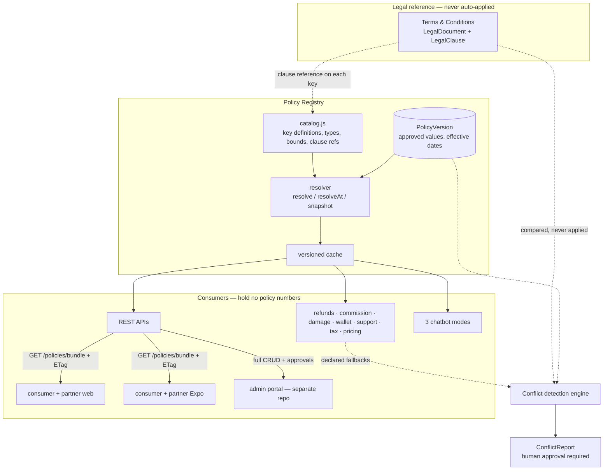
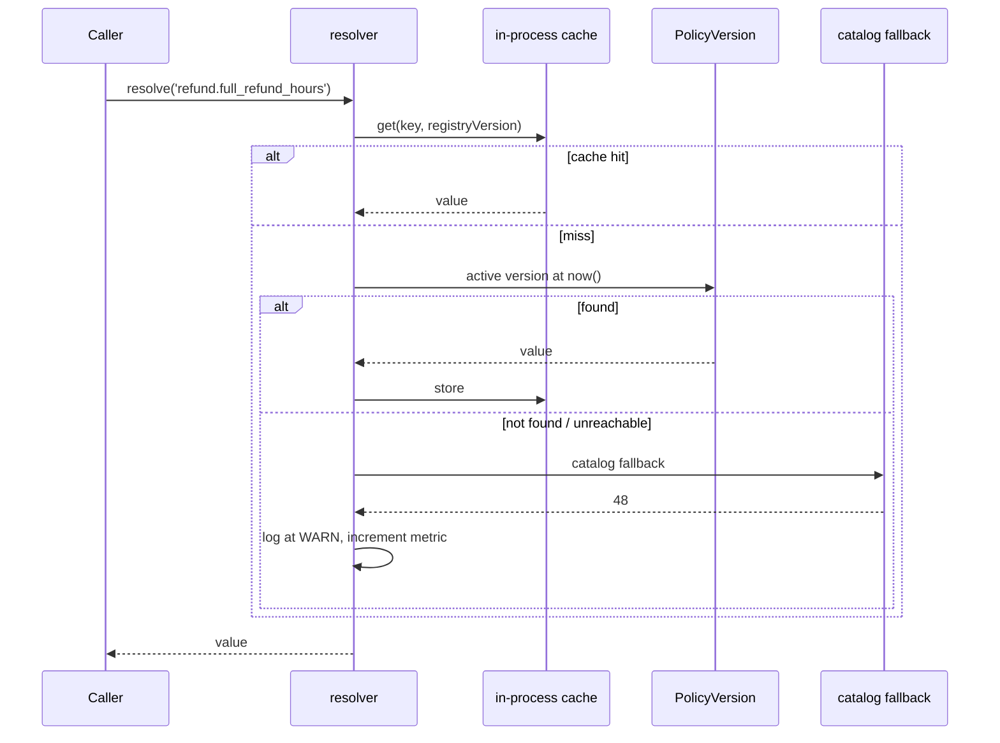
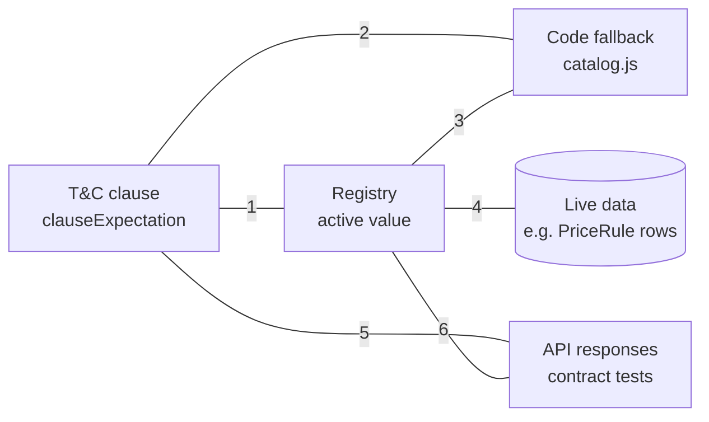
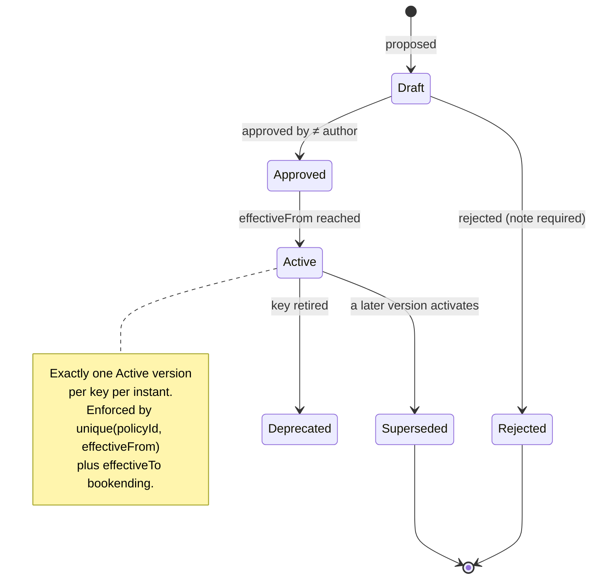
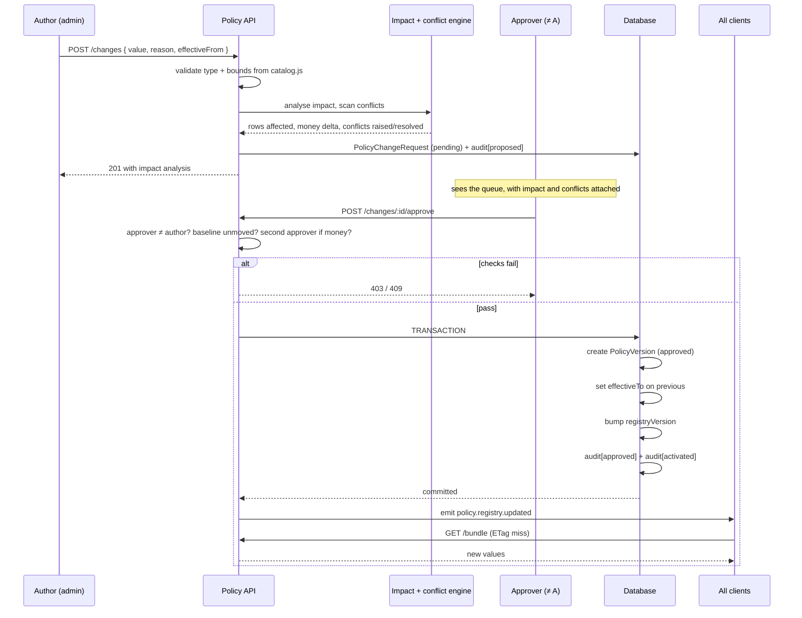

# 13 — Centralized Policy Registry

**Status:** design specification + implementation plan
**Problem it solves:** the 16 conflicts in `docs/12-tc-conflict-report.md`, and the class of
problem they belong to — the same business rule expressed in several places, drifting apart.
**Governing rule (unchanged):** the Terms & Conditions are the *legal* source of truth; the
Registry is the *operational* source of truth; a conflict between them produces a report and
a pause, never an automatic code change.

---

# Part A — Precedent in the existing codebase

This is not a greenfield idea. Two modules already implement most of it correctly, and the
Registry generalises them rather than replacing them.

### A1. `TaxConfig` — policy as data with point-in-time resolution

`prisma/schema.prisma:887` and `server/lib/tax/index.js:36`. Its header comment is the
thesis of this whole document:

> *Rates are data, never literals: a booking made under a 6% regime must invoice at 6%
> forever.*

It already has: value in a table, `effectiveFrom` / `effectiveTo` preserving full history,
`activeConfig(code, at)` resolving what was in force at an instant, an in-process cache
invalidated on write, and a code-level `FALLBACK_RATE` for an unseeded deployment.

**That is the Registry, for one key.** The work is generalising it to ~70 keys with
approval, audit and conflict detection attached.

### A2. `Booking.priceBreakdown` — snapshot on commit

> *Invoices read `Booking.priceBreakdown` — the snapshot taken at booking time — and never
> recompute.*

A resolved policy value is frozen onto the transaction at the moment of commitment.
This is the mechanism that fixes C-05 (commission re-pricing accepted bookings) and C-09
(bookings not bound to a T&C version).

### A3. Immutability conventions already in force

| Module | Convention |
|---|---|
| `Invoice` | Immutable once issued; a correction is a credit note, never an edit |
| `WalletLedgerEntry` | Append-only; a correction is a reversal row |
| `LegalDocument` | Immutable once published; a change is a new version row |
| `notifications/catalog.js` | Catalogue in code, reviewable in a PR, deploys with its behaviour |

The Registry follows all four. **Rollback creates a new version carrying the old values —
it never mutates or deletes history.** Forward-only correction is the house style, and it
is the only version of rollback that survives an audit.

---

# Part B — The three decisions that define this design

## B1. The Registry stores VALUES. Logic stays in code.

The most important call in this document, and the one most easily got wrong.

**In the Registry:** thresholds, percentages, windows, durations, limits, enumerations,
flags — `refund.full_refund_hours = 4`, `commission.rate.default = 0.20`,
`liability.cap_per_booking_myr = 1000`.

**In code:** the function that *uses* them. `eligibleRefund()` stays exactly where it is at
`server/lib/refunds/policy.js`; only its constants move.

```js
// Before
export const FULL_REFUND_HOURS = 48;
if (hoursNotice > FULL_REFUND_HOURS) return build(100, …);

// After
const p = await policies.forBooking(booking);       // resolved once, point-in-time
if (hoursNotice > p['refund.full_refund_hours']) return build(p['refund.full_percent'], …);
```

**Why not a rule engine that evaluates logic from the database?** Because a policy that
lives as executable data is not reviewable in a pull request, not unit-testable without a
database, not type-checked, not traceable in a stack trace, and is a remote-code-execution
surface reachable by whoever can write to a config table. The refund *shape* — tiers by
notice, with a partner-no-show override — changes maybe once a year. The *numbers* change
every quarter. Making the rare thing configurable at the cost of making the common thing
opaque is a bad trade.

The boundary is explicit in each key's definition (§C2): a key declares its type and
bounds, so `surge.max_multiplier` can never be set to 15 (C-08), and
`refund.full_refund_hours` can never be set to a string.

## B2. Resolution is point-in-time; commitment takes a snapshot

Three distinct reads, and conflating them is what caused C-05:

| Read | Question | Used by |
|---|---|---|
| `resolve(key)` | What is the rule **now**? | Quoting, display, chatbot answers |
| `resolveAt(key, instant)` | What was the rule **then**? | Audit, dispute reconstruction |
| `snapshot(scope)` | Freeze the rules governing **this transaction** | Booking confirm, job accept |

A booking confirmed today is governed by today's cancellation policy for its whole life,
even if the policy changes tomorrow — which is T&C 25.5 ("Amendments do not apply
retrospectively to a Booking confirmed before the effective date"), and simultaneously
T&C 7.6 for commission ("do not apply to Bookings already accepted"). One mechanism
satisfies both clauses.

**Snapshot boundaries** — the instant at which each scope freezes:

| Scope | Frozen at | Keys frozen |
|---|---|---|
| `booking` | confirmation | refund.*, cancellation.*, reschedule.*, noshow.*, tax.*, warranty.* |
| `assignment` | partner acceptance | commission.*, payout.* |
| `claim` | claim submission | damage.*, liability.* |
| `ticket` | ticket creation | support.sla.* |

Snapshots are stored as Json on the owning row (`Booking.policySnapshot`), following
`priceBreakdown`. Not a join table: a snapshot must survive independently of the Registry,
including if a key is later retired.

## B3. Keys are declared in code; values live in the database

```
server/lib/policy/catalog.js   ← WHAT keys exist: type, unit, bounds, scope, owner,
                                  governing T&C clause, code fallback
PolicyVersion (database)       ← WHAT the value currently is, who approved it, when
```

Same split as `notifications/catalog.js`, and for the same reason: the *schema* of the
system is reviewable in a pull request and deploys atomically with the code that consumes
it, while the *values* are operator-editable without a deploy.

Consequences that matter:

- An unknown key is a **deploy-time** error, not a runtime `undefined` that silently
  prices a booking at zero.
- Every key declares its **governing T&C clause** (or `null` for operational keys with no
  contractual basis). That single field is what makes conflict detection continuous and
  automatic (§F) instead of a manual audit someone remembers to run.
- Every key declares a **code fallback**, and a test asserts the fallback equals the seeded
  value. An unseeded or unreachable Registry degrades to the documented default rather
  than to `undefined`.

---

# Part C — Registry architecture

## C1. Layers



Note the two dotted paths from the T&C. It **informs** the catalogue (each key names its
clause) and it **feeds** conflict detection. It never writes a value. That is the standing
rule expressed as an arrow that does not exist.

## C2. Key definition shape

```js
{
  key: 'refund.full_refund_hours',
  domain: 'refund',
  type: 'integer',
  unit: 'hours',
  bounds: { min: 0, max: 720 },
  scope: 'booking',              // snapshot boundary (§B2)
  audience: ['consumer'],        // who may read it via the public bundle
  fallback: 48,                  // used only when the Registry is unreachable/unseeded
  clause: '8.1',                 // governing T&C clause — null if purely operational
  clauseExpectation: 4,          // what the clause says the value should be, if stated
  owner: 'finance',              // approval routing
  moneyAffecting: true,          // requires two approvers (§G3)
  description: 'Notice above which a cancellation is refunded in full.',
}
```

`clause` + `clauseExpectation` are the whole conflict-detection mechanism. A key whose
active value differs from its `clauseExpectation` raises a conflict automatically, on every
CI run and every proposed change. `refund.full_refund_hours` would have raised C-01 the day
it was written.

`clauseExpectation` is `null` where the clause states a rule but not a number ("a
Cancellation Fee applies") — those still get a clause reference, so the chatbot can cite
them, but no automatic numeric comparison.

## C3. Domains and key inventory (~70 keys)

| Domain | Keys | Governing clauses | Current home |
|---|---|---|---|
| `booking` | confirmation window, slot hold, dispatch accept window, arrival grace, reschedule window, max reschedules, recurring rules, emergency surcharge/eligibility | 6.3, 6.5, 6.8, 6.9, 6.10, 6.14 | **nowhere** (C-12) |
| `cancellation` | free window, fee band min/max, high-value threshold, high-value percent, repeat-cancel limit + window | 8.1, 8.2, 8.4 | **nowhere** (C-02) |
| `refund` | tier hours + percents, auto-approve ceiling, review SLA, processing days, cash refund method | 8.1, 9.2, 9.4, 9.5 | `refunds/policy.js:17` |
| `noshow` | customer grace, fee basis, high-value percent, partner-noshow remedy | 6.14, 6.15 | **nowhere** (C-13) |
| `payment` | enabled methods, cash eligibility rules, wallet credit expiry, coupon stacking, late-payment interest | 7.1, 7.5, 7.12, 10.9 | `payments/index.js`, partly hardcoded |
| `tax` | SST rate by code, inclusive flag, registration no, taxable categories | 7.8 | **`TaxConfig`** — already correct |
| `escrow` | release-after-confirm hours, release-no-response hours, freeze conditions, manual-approval threshold | 7.9 | **nowhere** (C-04) |
| `commission` | rate by tier, tier definitions, effective dating, settlement period, credit limit | 7.6, 7.13 | `payments/commission.js:24` |
| `payout` | run frequency, minimum balance, bank-verification requirement, hold reasons | 7.13, 7.14 | `payouts/schedule.js` |
| `liability` | cap per booking, cap per 12 months, insurance referral threshold, max claim intake | 20.7, 20.10 | `damageClaims/sla.js:25` (C-06) |
| `warranty` | workmanship days by category, complaint window by category, re-performance access days | 28.2, 28.3, 28.6 | **nowhere** (C-10) |
| `damage` | reporting window, required evidence, SLA clocks, compensation deadline | 20.10, 28.3 | `damageClaims/sla.js:11` |
| `support` | SLA first-response + resolution by priority, escalation thresholds, CSAT window, callback window | — (operational) | `support/sla.js:8` |
| `partner` | verification requirements, re-verification interval, rating thresholds, freeze/suspend days, reinstatement | 4.3, 5.9, 11.19 | `wallet/freeze.js:24` |
| `pricing` | max surge multiplier, surcharge caps, travel surcharge bands | 10.6, 10.7 | **unbounded** (C-08) |
| `retention` | booking/financial years, chat days, dormancy months | 17.4, 18.11, 5.12 | **nowhere** (C-11) |
| `legal` | current terms version by slug, re-acceptance trigger, change notice days | 25.2, 25.5 | `LegalDocument` — partly |

Two rows are the point of the exercise: `tax` is already right and needs only re-homing;
seven rows say **nowhere**, and each of those is a conflict in `docs/12`.

## C4. Resolution and caching



**Cache invalidation is by version stamp, not TTL.** A single `registryVersion` integer
increments on every activation. Clients hold it; a mismatch invalidates everything. TTL
caching would mean "the policy changed but the app quoted the old number for five more
minutes" — which for a refund figure is the exact failure this system exists to prevent.

**Fail-safe behaviour, by consumer:**

| Consumer | Registry unreachable |
|---|---|
| Money-affecting server path (refund, commission, payout) | **Fail closed.** Use the transaction's existing snapshot if present; otherwise refuse the operation and alert. Never guess with a fallback where money moves. |
| Quoting / display | Fall back to catalog value, flag the response `stale: true` |
| Chatbot policy answer | **Never answer.** "I don't have the current policy to hand — let me connect you to support." (explicit requirement) |
| Client bundle | Serve last known good with its `ETag`; client keeps its cached copy |

---

# Part D — Database schema

Additive. One migration, `policy_registry`. No existing table altered except three
snapshot columns.

```prisma
// A policy key. One row per key in catalog.js — created by a sync task, never by
// hand, so the database can never contain a key the code does not know about.
model Policy {
  id          String   @id @default(cuid())
  key         String   @unique          // "refund.full_refund_hours"
  domain      String                    // "refund"
  scope       String                    // booking | assignment | claim | ticket | global
  type        String                    // integer | decimal | percent | money | duration
                                        // | boolean | enum | list | json
  unit        String?                   // hours | days | myr | multiplier | percent
  clause      String?                   // governing T&C clause, e.g. "8.1"
  owner       String                    // finance | ops | legal | trust | engineering
  moneyAffecting Boolean @default(false)
  isRetired   Boolean  @default(false)  // retired, never deleted — snapshots reference it
  description String
  createdAt   DateTime @default(now())
  updatedAt   DateTime @updatedAt

  versions PolicyVersion[]
  changes  PolicyChangeRequest[]

  @@index([domain])
  @@index([clause])
}

// An immutable value with a life span. Never updated after activation; superseding
// sets effectiveTo on the previous row, exactly as TaxConfig does today.
model PolicyVersion {
  id            String    @id @default(cuid())
  policyId      String
  version       Int                      // monotonic per policy, starts at 1
  value         Json                     // typed per Policy.type; Json so a key can hold
                                         // a band, a list or an object without a schema change
  status        String    @default("draft") // draft | approved | active | superseded | deprecated
  effectiveFrom DateTime
  effectiveTo   DateTime?                // set when superseded — preserves full history
  changeSummary String
  reason        String                   // WHY. Required — an audit trail without motive is a log.
  authorId      String
  approverId    String?
  approvedAt    DateTime?
  activatedAt   DateTime?
  supersededById String?
  rolledBackFrom Int?                    // set when this version restores an earlier one
  createdAt     DateTime  @default(now())

  policy Policy @relation(fields: [policyId], references: [id])

  @@unique([policyId, version])
  @@unique([policyId, effectiveFrom])
  @@index([policyId, status])
  @@index([status, effectiveFrom])
}

// A proposed change, before it becomes a version. Carries its own impact analysis
// and conflict scan so an approver sees consequences, not just a number.
model PolicyChangeRequest {
  id             String   @id @default(cuid())
  policyId       String
  proposedValue  Json
  currentValue   Json                    // snapshot at proposal time — detects a race
  reason         String
  effectiveFrom  DateTime
  status         String   @default("pending") // pending | approved | rejected | withdrawn | applied
  impactAnalysis Json?                   // rows affected, money delta, dependent keys
  conflictIds    Json?                   // ConflictReport ids raised by this change
  authorId       String
  decidedById    String?
  decidedAt      DateTime?
  decisionNote   String?
  resultVersionId String?
  createdAt      DateTime @default(now())

  policy Policy @relation(fields: [policyId], references: [id])

  @@index([status, createdAt])
  @@index([policyId, status])
}

// Append-only. Written in the same transaction as the thing it records, so an
// action cannot exist without its log line.
model PolicyAuditLog {
  id           String   @id @default(cuid())
  policyId     String?
  policyKey    String                    // denormalised — survives a retired key
  action       String                    // proposed | approved | rejected | activated
                                         // | superseded | rolled_back | conflict_raised
                                         // | conflict_resolved | fallback_used
  actorId      String?                   // null for system actions
  actorRole    String?
  previousValue Json?
  newValue     Json?
  reason       String?
  requestId    String?                   // correlates with the change request
  ipAddress    String?                   // recorded server-side, never from the body
  userAgent    String?
  createdAt    DateTime @default(now())

  @@index([policyKey, createdAt])
  @@index([actorId, createdAt])
  @@index([action, createdAt])
}

// A detected disagreement between the T&C, the Registry, the code and the data.
// Created by the engine; resolved only by a human.
model ConflictReport {
  id             String    @id @default(cuid())
  reference      String    @unique       // "CONF-2026-0001"
  policyKey      String?
  clause         String?                 // "8.1"
  severity       String                  // critical | high | medium | low
  status         String    @default("open") // open | acknowledged | approved_to_fix
                                            // | approved_amend_tc | wont_fix | resolved
  title          String
  clauseText     String?                 // quoted, so the report stands alone
  clauseExpected Json?
  currentValue   Json?
  currentSource  String?                 // registry | code | database | api
  customerImpact String
  financialImpact String?                // quantified where possible
  technicalImpact String?
  recommendation String
  filesAffected  Json?                   // ["server/lib/refunds/policy.js:17"]
  detectedBy     String    @default("engine") // engine | audit | report
  firstDetectedAt DateTime @default(now())
  lastSeenAt     DateTime  @default(now())
  decidedById    String?
  decidedAt      DateTime?
  decisionNote   String?
  resolvedAt     DateTime?

  @@index([status, severity])
  @@index([policyKey])
  @@unique([policyKey, clause, title])   // re-detection updates lastSeenAt, not a duplicate row
}
```

**Three snapshot columns on existing tables** (the only non-additive touch, and each is a
nullable add):

```prisma
model Booking {
  policySnapshot   Json?   // resolved keys governing this booking, frozen at confirmation
  registryVersion  Int?
  termsDocumentId  String? // closes C-09
}
model DamageClaim   { policySnapshot Json?  registryVersion Int? }
model SupportTicket { policySnapshot Json?  registryVersion Int? }
```

Commission is snapshotted onto `Booking.policySnapshot` at **acceptance** rather than a
separate column, which closes C-05 without a second mechanism.

## D1. Migration strategy

Six steps, each independently deployable and reversible.

| Step | Action | Risk |
|---|---|---|
| 1 | Create tables. Nothing reads them. | None |
| 2 | Seed `Policy` rows from `catalog.js`; seed v1 `PolicyVersion` **with the values the code uses today** — not the T&C values | None: the system is a no-op replica of current behaviour |
| 3 | Run the conflict engine. It reproduces `docs/12` from data. Every existing conflict is now a tracked row rather than a document. | None — reports only |
| 4 | Migrate consumers one module at a time behind `POLICY_REGISTRY_ENABLED`, asserting resolved == hardcoded in a parity test before the constant is deleted | Low |
| 5 | Backfill `policySnapshot` on open bookings from the seeded v1 values | Low |
| 6 | Delete the constants. The no-hardcode test (§K1) starts enforcing. | Low |

**Step 2 is the discipline that makes this safe.** Seeding with the *contract's* values
would silently apply all 16 conflicts in one deploy — precisely the automatic change the
standing rule forbids. The Registry starts as a faithful mirror of today's behaviour, the
conflicts become visible and tracked, and each is then fixed **by an approved change
request** with an audit trail naming who decided it.

---

# Part E — API specification

All under `/api/policies`. Existing endpoints elsewhere are unchanged.

| Method | Path | Auth | Purpose |
|---|---|---|---|
| `GET` | `/policies/bundle` | public / user | Client bundle, audience-filtered, `ETag` |
| `GET` | `/policies` | admin | List + filter by domain, owner, status, clause |
| `GET` | `/policies/:key` | admin | Definition + active value + history summary |
| `GET` | `/policies/:key/versions` | admin | Full version history |
| `GET` | `/policies/:key/versions/:v` | admin | One version |
| `GET` | `/policies/:key/at` | admin | Value in force at `?instant=` |
| `GET` | `/policies/:key/compare` | admin | Diff `?from=3&to=5` |
| `POST` | `/policies/:key/changes` | admin | Propose a change → impact + conflict scan |
| `GET` | `/policies/changes` | admin | Pending-approval queue |
| `POST` | `/policies/changes/:id/approve` | **approver ≠ author** | Approve; creates the version |
| `POST` | `/policies/changes/:id/reject` | approver | Reject with a mandatory note |
| `POST` | `/policies/:key/rollback` | approver | Propose restoring version N (forward-only) |
| `GET` | `/policies/audit` | admin | Audit log, filterable |
| `GET` | `/policies/conflicts` | admin | Conflict reports |
| `POST` | `/policies/conflicts/scan` | admin | Run the engine on demand |
| `POST` | `/policies/conflicts/:id/decide` | **super_admin** | Record a human decision |
| `GET` | `/policies/conflicts/export` | admin | CSV / Markdown for legal |

## E1. The bundle — how every client stays consistent

```http
GET /api/policies/bundle?audience=consumer&locale=en
If-None-Match: "rv-1487"
```

```jsonc
// 200 OK — ETag: "rv-1487", Cache-Control: public, max-age=60, must-revalidate
{
  "registryVersion": 1487,
  "generatedAt": "2026-08-02T09:14:03.000Z",
  "policies": {
    "refund.full_refund_hours": { "value": 48, "unit": "hours", "clause": "8.1" },
    "cancellation.free_window_hours": { "value": 4, "unit": "hours", "clause": "8.1" },
    "damage.reporting_window_hours": { "value": 48, "unit": "hours", "clause": "20.10" }
  }
}
```

`304 Not Modified` on a matching `ETag` — the common case, and near-free. Audience
filtering is server-side: a consumer bundle never contains `commission.rate.default`, so a
customer cannot read the partner commission out of a JavaScript bundle.

Clients subscribe to `policy.registry.updated` over the existing Socket.IO channel
(`server/lib/notifications`) and re-fetch on the event, so a change propagates in seconds
without polling.

## E2. Proposing a change

```http
POST /api/policies/refund.full_refund_hours/changes
Authorization: Bearer <admin jwt>
```
```jsonc
{
  "proposedValue": 4,
  "reason": "Align with T&C clause 8.1 — resolves CONF-2026-0001",
  "effectiveFrom": "2026-08-16T00:00:00+08:00"
}
```
```jsonc
// 201 Created
{
  "id": "chg_7f3a",
  "status": "pending",
  "requiresApprovers": 2,                    // moneyAffecting
  "impactAnalysis": {
    "openBookingsAffected": 0,               // snapshots protect confirmed bookings
    "futureBookingsAffected": "all",
    "estimatedMonthlyRefundDelta": { "amount": 18400, "currency": "MYR", "direction": "increase" },
    "dependentKeys": ["cancellation.free_window_hours", "refund.partial_percent"],
    "consumersAffected": ["refunds/policy.js", "chatbot c.refund.policy", "consumer web", "consumer app"]
  },
  "conflicts": {
    "resolves": ["CONF-2026-0001"],
    "raises": []
  }
}
```

Two properties worth calling out. `currentValue` is captured at proposal time and
re-checked at approval — if someone else changed the key in between, approval **fails**
rather than silently applying to a different baseline. And `effectiveFrom` may be in the
future, so a change requiring 14 days' notice under T&C 25.2 can be approved now and
activated on the right date, with the notice obligation visible in the impact analysis.

## E3. Approval

```http
POST /api/policies/changes/chg_7f3a/approve
```
```jsonc
{ "note": "Approved by Finance and Legal. Reconciliation of historical cases tracked separately." }
```

Rejects with `409` if the author is the approver, if `currentValue` has moved, or if a
second approver is required and this is the first. On success: creates the
`PolicyVersion`, sets `effectiveTo` on the superseded row, bumps `registryVersion`, writes
the audit line, and emits the update event — all in **one transaction**.

## E4. Rollback is forward-only

```http
POST /api/policies/commission.rate.default/rollback
{ "toVersion": 3, "reason": "v4 tier change had unintended effect on settlements" }
```

Creates a **change request** proposing v3's value as a new v5, marked
`rolledBackFrom: 4`. It goes through the same approval path as any other change. History
is never rewritten and v4 remains queryable — the same reasoning that makes an `Invoice`
correction a credit note rather than an edit.

## E5. Errors

| Code | When |
|---|---|
| `400 policy_value_out_of_bounds` | Fails the catalogue's declared bounds |
| `400 policy_value_type_mismatch` | Wrong type for the key |
| `403 approver_must_differ_from_author` | Separation of duties |
| `403 second_approver_required` | Money-affecting, one approval so far |
| `409 baseline_moved` | Value changed since proposal |
| `409 conflict_unresolved` | Would activate against an open critical conflict |
| `422 unknown_policy_key` | Not in `catalog.js` |
| `503 registry_unavailable` | Money path with no snapshot — fail closed |

---

# Part F — Conflict detection engine

## F1. What it compares

Four sources, six pairwise checks:



| # | Check | Catches |
|---|---|---|
| 1 | Clause vs Registry | **C-01, C-02, C-06, C-07** — the contract says one thing, the platform does another |
| 2 | Clause vs code fallback | A fallback that would breach the contract if the Registry were down |
| 3 | Registry vs code fallback | Drift after a change — the fallback is now stale |
| 4 | Registry vs live data | **C-08** — a `PriceRule` surge of 2.0 against a 1.5 cap |
| 5 | Clause vs API | A response shape promising something the contract does not |
| 6 | Registry vs API | An endpoint that still hardcodes |

Checks 1–4 run in CI on every commit and nightly against production data. 5–6 run as
contract tests.

**Absence is a conflict too.** A clause carrying a stated number with **no key at all**
raises a `missing_policy` conflict — which is how C-04, C-10, C-11, C-12 and C-13 (all
"nowhere" rows in §C3) get detected automatically rather than by someone reading the
contract carefully.

## F2. Severity assignment

Automatic, from the key's own metadata — not a judgement call at detection time:

| Severity | Rule |
|---|---|
| **Critical** | `moneyAffecting` **and** the divergence moves money **away from** the party the contract favours |
| **High** | `moneyAffecting`, or a contractual control that does not exist |
| **Medium** | Contractual mismatch, no immediate money movement, or an evidentiary gap |
| **Low** | A promised feature is absent and the clause is permissive ("may") |

Direction matters and is computed, not assumed. A code value **more generous** than the
contract (C-07: a 48-hour damage window against a 24-hour clause) is Medium, because no
customer is harmed. A value **less generous** (C-01) is Critical.

## F3. Report generation

Every field the standing rule requires, produced automatically:

```jsonc
{
  "reference": "CONF-2026-0001",
  "severity": "critical",
  "status": "open",
  "policyKey": "refund.full_refund_hours",
  "clause": "8.1",
  "clauseText": "A Customer may cancel a confirmed Booking free of charge at any time more than four (4) hours before the scheduled start time. The full amount paid is refunded…",
  "clauseExpected": 4,
  "currentValue": 48,
  "currentSource": "registry",
  "expectedBehaviour": "Cancellation more than 4 hours before start refunds 100%.",
  "customerImpact": "Customers cancelling 4–48h ahead are refunded 75% instead of 100% — a 25% shortfall on every affected cancellation.",
  "financialImpact": {
    "perTransaction": { "basis": "25% of booking value", "exampleMyr": 50, "exampleBookingMyr": 200 },
    "populationQuery": "RefundRequest where policy IN ('cancel_4_to_48h','partner_accepted')",
    "historicalExposure": "computed at scan time",
    "direction": "customer_underpaid"
  },
  "technicalImpact": "policy.js:17 constant; consumed by refunds route, cancellation UI, chatbot c.refund.policy. Snapshot backfill needed for open bookings.",
  "recommendation": "Change FULL_REFUND_HOURS 48 → 4 via an approved change request. Decide historical reconciliation separately.",
  "filesAffected": ["server/lib/refunds/policy.js:17", "server/lib/chatbot/knowledge.js:37"],
  "humanApprovalRequired": true
}
```

`filesAffected` is derived from a static consumer map built at CI time (which module reads
which key), so it stays accurate as code moves.

## F4. What the engine never does

- Never writes a `PolicyVersion`.
- Never edits code.
- Never auto-resolves a conflict, even a Low one.
- Never blocks a deploy on a **pre-existing** conflict — that would make the first CI run
  after adoption fail on all 16 and get the check disabled. It blocks on a **newly
  introduced** one, which is the check that actually holds the line.

Re-detection updates `lastSeenAt` on the existing row rather than creating a duplicate, so
the conflict list is a stable work queue rather than a growing pile.

---

# Part G — Versioning, approval and audit

## G1. Lifecycle



## G2. The approval workflow, end to end



## G3. Separation of duties

| Rule | Enforced |
|---|---|
| Approver ≠ author | Always |
| Two approvers | `moneyAffecting` keys |
| Approver from the owning function | `owner` field routes the queue |
| Conflict decisions | `super_admin` only |
| Legal-domain keys | Require a `legal` approver |

A single admin cannot move money by themselves. That is the control the 16 conflicts argue
for — several of them are not code errors so much as the absence of anyone having to say
yes.

## G4. Audit logging

Written **in the same transaction** as the action, so an action cannot exist without its
log line. Append-only: no update or delete path is exposed, and the route layer has no
handler for either.

Every entry carries who (`actorId`, `actorRole`), what (`policyKey`, `previousValue`,
`newValue`), when (`createdAt`), why (`reason` — mandatory, and rejected if blank), and
where from (`ipAddress`, `userAgent` — recorded server-side, never read from the request
body, matching the `LegalAcceptance` convention at `server/lib/legal/index.js:96`).

`fallback_used` is also logged. If the Registry is unreachable and a service falls back to
a catalogue default, that is an operational event worth seeing in the same timeline as the
policy changes themselves — it is often the explanation for a number nobody can account
for.

---

# Part H — Security model

| Concern | Control |
|---|---|
| Who reads a policy | Audience filter on the bundle. Partner and internal keys never reach a consumer client |
| Who proposes | `requireRole('admin','super_admin')` |
| Who approves | Different user; `owner`-routed; two for money |
| Who decides conflicts | `super_admin` only |
| Value tampering | Type + bounds validated from `catalog.js` on write **and** on read — a value written directly to the database out of band still fails validation at resolution and falls back |
| Unknown keys | Impossible: `Policy` rows are synced from `catalog.js`, and the API rejects any key not in the catalogue |
| Replay / race | `currentValue` baseline check at approval |
| Audit tampering | Append-only; no update/delete route exists |
| Cache poisoning | `registryVersion` is server-issued and monotonic; clients cannot set it |
| Injection | Values are typed data, never expressions. §B1 — nothing from the Registry is ever evaluated |
| Secrets | The Registry holds business rules only. No credentials, no keys. Enforced by a test that rejects any key matching a secret-shaped name |
| Cross-origin | Admin portal is a separate origin (`servisaku-admin`); its URL must be in `CORS_ORIGIN` (`server/index.js:49`) |

The row worth dwelling on is **injection**. Because §B1 keeps logic in code, a compromised
Registry writer can set a bad *number* — bounded, audited, and visible in a diff — but
cannot introduce behaviour. A rule engine would have handed them arbitrary execution inside
the pricing path.

---

# Part I — Admin portal UX

**Implementation note:** the admin website is a separate repository owned by another
developer (`docs/10-remaining-features.md` §A5). This section is a **specification and API
contract**, not work in this repo. What ships here is the API.

### Screens

| Screen | Contents |
|---|---|
| **Registry** | All keys grouped by domain. Columns: key, active value, unit, clause, owner, last changed, conflict badge. Filter by domain/owner/status/clause; search by key or clause |
| **Policy detail** | Definition (type, bounds, scope, clause), active value, full version timeline, consumers list, related conflicts |
| **Version compare** | Side-by-side diff of two versions with author, approver, reason, effective window |
| **Propose change** | Value input typed to the key (bounds enforced in the field), reason (required), effective date. **Live impact panel** updates as the value changes — rows affected, money delta, conflicts raised or resolved |
| **Approval queue** | Pending requests sorted by effective date. Each row shows impact and conflicts inline; approve/reject with a mandatory note. Self-approval visibly disabled with the reason shown |
| **Conflicts** | Board grouped by severity. Detail shows quoted clause beside current value. Decisions: change code · amend T&C · won't fix · defer — each requiring a note. Export to CSV/Markdown |
| **Audit** | Filterable timeline: actor, key, action, before → after, reason. Exportable |

### Interaction rules

- **The value input is typed to the key.** A percent key gets a percent control bounded
  0–100; a duration gets a unit-aware control. Free-text entry of policy values is how a
  1.5x surge cap becomes 15.
- **Impact before commit, always.** The propose screen must never have a save button that
  precedes the impact panel rendering.
- **The clause is shown beside the value** on any key with a `clause`, quoted verbatim.
  The person changing a refund percentage should be reading the sentence that governs it.
- **Effective-date warnings.** If a key's clause requires notice (T&C 25.2, 14 days),
  choosing an earlier date shows the obligation. It does not block — sometimes a change is
  wholly to the user's benefit and 25.3 permits immediate effect — but it must be a
  deliberate override.
- **Destructive-styling for money keys**, matching the action-card convention in
  `docs/11-ai-chatbots.md` §L2.

---

# Part J — Integration plan

Ten consumers. Each stops holding numbers and starts asking.

| # | Consumer | Change | Phase |
|---|---|---|---|
| 1 | **Backend services** | Constants → `policies.resolve()`; snapshot at commit boundaries | 3 |
| 2 | **Backend APIs** | Responses carry `registryVersion`; policy-shaped fields sourced from the resolver | 3 |
| 3 | **Consumer website** (`src/apps/consumer`) | `PolicyProvider` context fetching the bundle; replaces literals in refund/cancel/booking UI | 5 |
| 4 | **Partner website** (`src/apps/partner`) | Same provider; commission, payout, freeze-threshold display | 5 |
| 5 | **Consumer app** (`servisaku-consumer/`) | Same bundle, persisted to storage for offline; refreshed on foreground | 6 |
| 6 | **Partner app** (`servisaku-partner/`) | Same | 6 |
| 7 | **Consumer chatbot** | Policy answers resolve at answer time; no numbers in `knowledge.js` | 4 |
| 8 | **Partner chatbot** | Same, partner audience | 4 |
| 9 | **Help & Support chatbot** | Same; troubleshooting trees read thresholds from the Registry | 4 |
| 10 | **Support dashboard / admin portal** (separate repo) | Full API; agent-facing SLA and refund figures from the bundle | 5 |

## J1. Chatbot integration — the explicit requirement

The chatbots must never contain hardcoded policy values, must reflect Registry updates
automatically, and must decline when no approved policy exists.

Mechanism, building on `docs/11-ai-chatbots.md`:

1. `knowledge.js` corpus answers become **templates with policy placeholders**:
   `"more than {{refund.full_refund_hours}} hours before the booking is a full refund"`.
2. Placeholders are resolved **at answer time** against the Registry, per turn. A change
   propagates to the next message — no deploy, no cache warm-up.
3. Any unresolved placeholder makes the entry **non-answerable**: the bot does not emit a
   partial sentence with a gap in it. It says the information is unavailable and offers
   support — exactly the required behaviour, and it falls out of the design rather than
   needing a special case.
4. A test asserts **no numeric literal in any corpus answer** for a policy-bearing topic.

This also retires the C-01 problem at its root: `knowledge.js:37` currently states the
refund tiers as prose, which is a fourth copy of the rule. After this it holds none.

## J2. Backwards compatibility

No existing endpoint changes shape. `registryVersion` is an added field. Constants are
deleted only in phase 6, after a parity test proves the resolved value equals the constant
for every key. Every phase is independently revertible, and `POLICY_REGISTRY_ENABLED=false`
restores catalogue fallbacks — which are, by construction, today's values.

---

# Part K — Testing strategy

## K1. No hardcoded policy values

The check the whole exercise depends on. Three layers, because one is evadeable:

1. **Static scan** — a test walks the policy-owning modules (`refunds/`, `payments/`,
   `damageClaims/`, `wallet/`, `payouts/`, `support/`, `tax/`, `chatbot/knowledge.js`) and
   fails on a numeric literal outside an allow-list (0, 1, 100, array indices, unit
   conversions such as `3600_000`). Every remaining literal must carry an
   `// policy-exempt: <reason>` comment, which makes the exception visible in review
   instead of invisible in code.
2. **Corpus scan** — no digit-bearing policy claim in any chatbot answer for a
   policy-bearing topic.
3. **Consumer map** — each policy-owning module declares the keys it reads; a test asserts
   the declaration matches actual resolver calls. This is also what makes `filesAffected`
   in a conflict report accurate.

## K2. The rest

| Area | Tests |
|---|---|
| **Resolution** | `resolve` returns the active value; `resolveAt` returns the historical one across a supersession boundary; unseeded key falls back and logs; unknown key throws |
| **Snapshots** | A booking confirmed before a change is unaffected by it (T&C 25.5); an assignment accepted before a commission change settles at the old rate (T&C 7.6 — reproduces C-05 as a regression test) |
| **Bounds** | Out-of-bounds rejected on write; a value written out of band is rejected on read and falls back (reproduces C-08) |
| **Conflict engine** | Each of the six checks; severity direction (generous = Medium, ungenerous = Critical); `missing_policy` for a clause with no key; re-detection updates rather than duplicates; **the engine never writes a version** |
| **Versioning** | Monotonic; exactly one active per instant; future `effectiveFrom` activates on time and not before |
| **Rollback** | Restores the value, creates a *new* version, leaves history intact, requires approval |
| **Approval** | Self-approval rejected; money key needs two; moved baseline rejected; reason required |
| **Audit** | Every mutation writes a line in the same transaction; no update/delete path exists; a rolled-back transaction leaves no orphan line |
| **Chatbot** | Answers reflect a changed value on the next turn with no restart; an unresolved placeholder declines and offers support rather than emitting a gap |
| **Bundle** | Audience filtering (no `commission.*` in a consumer bundle); `ETag` 304; version bump invalidates |
| **Parity (migration)** | For every key, resolved value == the constant it replaces — asserted **before** the constant is deleted |

## K3. Fixtures worth stating

The 16 conflicts in `docs/12` become the conflict engine's fixture set. If the engine
cannot reproduce all 16 from seeded data, it does not work. That is the acceptance test for
Part F, and it is objective.
